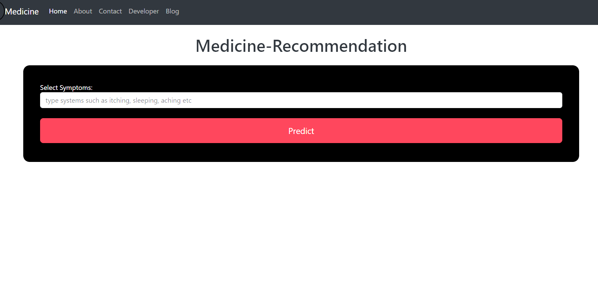

# Medical Recommendation System

<b> Objective : </b>

To develop a personalized medicine recommendation system using machine learning algorithms. treatment plans based on individual patient characteristics, genetic data, and medical history. Improve patient outcomes by providing more effective and targeted medical interventions.

<b> Functionality & Concepts used : </b>

<b>Programming Languages: </b>  
- Python: Widely used for machine learning and data science

<b>Machine Learning Frameworks: </b>
- Scikit-learn: Provides simple and efficient tools for data analysis and modelling.
- TensorFlow and PyTorch: Deep learning frameworks for building and training neural networks.

<b>Libraries Used : </b>
- Sci-Kit Learn :It provides a selection of efficient tools for machine learning and statistical modeling including classification, regression, clustering and dimensionality reduction via a consistence interface in Python.
- Matplotlib :It is a library that is specifically designed to do effective data visualization.
- Numpy : It is a library which works with arrays.
- Seaborn : It is also a library which is used for visualizations.
